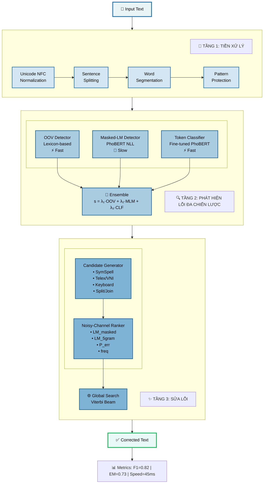
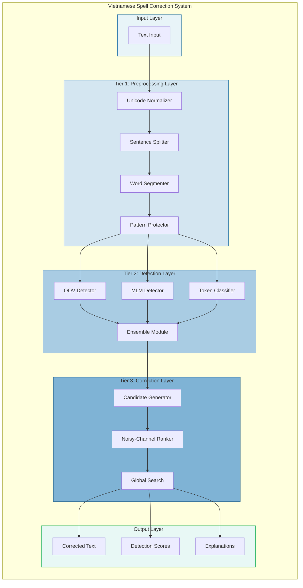
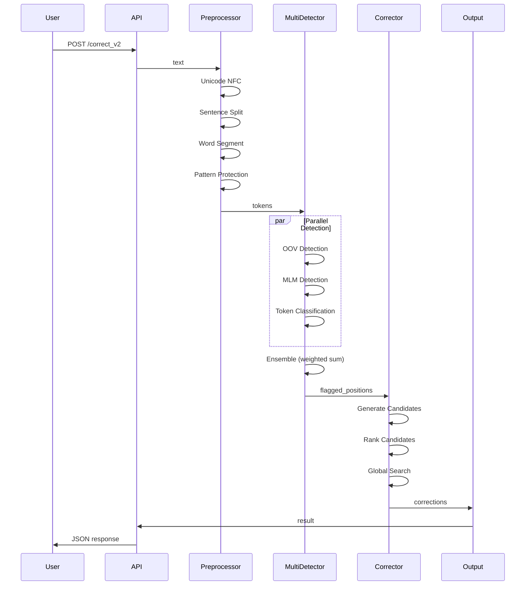
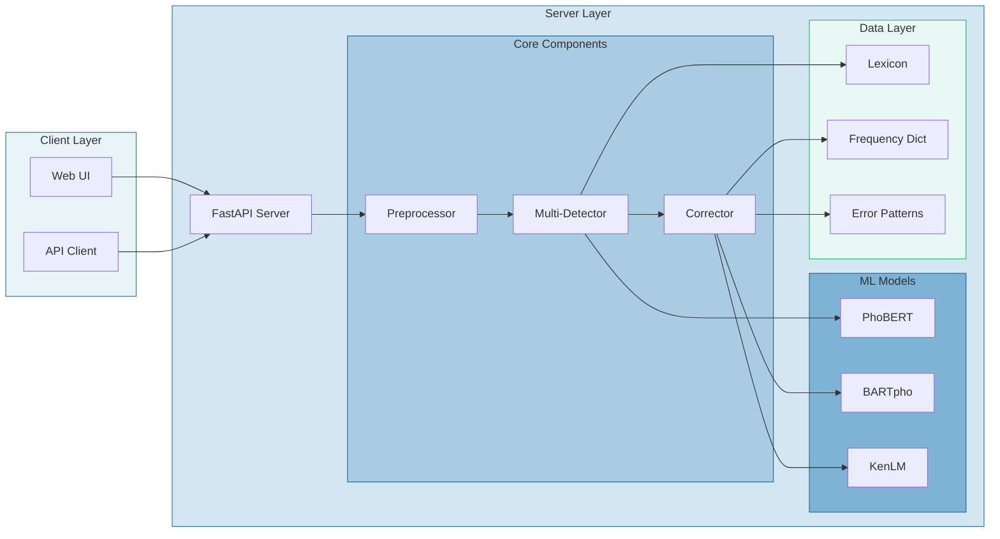

# Sơ đồ Kiến trúc Hệ thống (Mermaid)

## Cách 1: Flowchart chi tiết



## Cách 2: Flowchart đơn giản

```mermaid
flowchart TD
    A[📝 Input Text] --> B[🔧 Preprocessing]
    B --> B1[Unicode NFC]
    B --> B2[Sentence Split]
    B --> B3[Word Segment]
    B --> B4[Pattern Protection]
    
    B1 & B2 & B3 & B4 --> C[🔍 Multi-Detector]
    
    C --> C1[OOV Detector]
    C --> C2[Masked-LM Detector]
    C --> C3[Token Classifier]
    
    C1 & C2 & C3 --> C4[Ensemble]
    
    C4 --> D[✨ Correction]
    
    D --> D1[Candidate Generator]
    D1 --> D2[Noisy-Channel Ranker]
    D2 --> D3[Global Search]
    
    D3 --> E[✅ Corrected Text]
    
    E --> F[📊 F1=0.82 | EM=0.73]
    
    style A fill:#E8F4F8,stroke:#2874A6,stroke-width:3px
    style B fill:#D4E6F1,stroke:#2874A6,stroke-width:2px
    style C fill:#A9CCE3,stroke:#1F618D,stroke-width:2px
    style D fill:#7FB3D5,stroke:#21618C,stroke-width:2px
    style E fill:#E8F8F5,stroke:#28B463,stroke-width:3px
    style F fill:#FEF5E7,stroke:#E67E22,stroke-width:2px
```

## Cách 3: Architecture Diagram (C4 Model style)



## Cách 4: Sequence Diagram (Data Flow)



## Cách 5: Component Diagram



---

## Cách sử dụng

### 1. Render trực tiếp trên GitHub
- Copy code Mermaid vào file `.md`
- GitHub sẽ tự động render

### 2. Render trên Mermaid Live Editor
- Truy cập: https://mermaid.live
- Paste code Mermaid
- Export PNG/SVG

### 3. Render trong VS Code
- Install extension: "Markdown Preview Mermaid Support"
- Preview file này (Ctrl+Shift+V)

### 4. Render trong Overleaf/LaTeX
- Sử dụng package `mermaid` hoặc export PNG từ Mermaid Live

